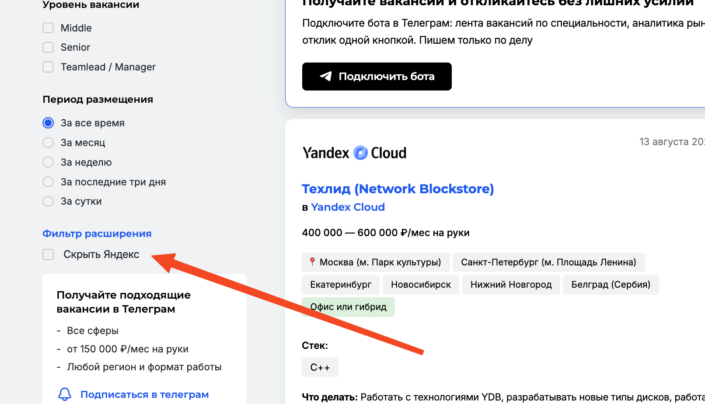

# Yandex Filter

## Описание

Браузерное расширение для Chrome, которое добавляет фильтр "Скрыть Яндекс" на страницу вакансий крупных сайтов. При активации фильтра скрываются все вакансии яндекса

## Установка

1. Скачайте или клонируйте репозиторий
2. Откройте Chrome и перейдите на `chrome://extensions/`
3. Включите "Режим разработчика" (переключатель справа вверху)
4. Нажмите "Загрузить распакованное расширение"
5. Выберите папку с расширением
6. Откройте https://getmatch.ru/vacancies - фильтр появится в левой панели
